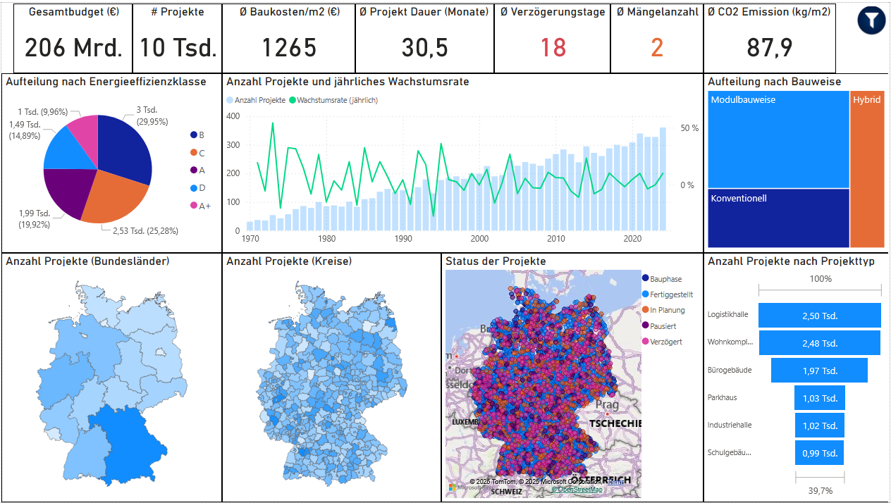

# 🏗️ Construction Projects Intelligence Dashboard

This Power BI dashboard visualizes and analyzes a large-scale simulated dataset of construction projects in Germany. The data is **entirely fictive** and created for the purpose of exploring real-world analytical use cases in the construction industry, including sustainability, digitalization, cost efficiency, and project progress across time and regions.

---

## 📷 Dashboard Preview

---

## 📊 Key Features

### 🎯 High-Level KPIs
- **Gesamtbudget** (Total Budget in €)
- **# Projekte** (Total Project Count)
- **Ø Baukosten/m²** (Average Construction Cost per Square Meter)
- **Ø Projektdauer** (Average Project Duration)
- **Ø Verzögerungstage** (Average Delay)
- **Mängelanzahl** (Reported Defects)
- **Ø CO₂ Emission (kg/m²)**

### 🗺️ Geographical Insights
- Project distribution across **16 Bundesländer**
- Drilldown-enabled **Shape Maps** from **Region → Kreis (District)**
- Bubble map of project statuses across Germany

### 📈 Analytical Visuals
- Pie chart of **Energieeffizienzklassen**
- Box/funnel charts for **Project Types** and **Construction Methods**
- Line + bar combo chart for **project growth trend over years**
- Tree map breakdown by **Bauweise**

---

## 🧭 Navigation & Filters

In addition to clickable charts, the dashboard includes a **toggleable filter panel** (top-right filter icon 🔎) where users can:
- Filter by **Projektname**
- Filter by **Projektleiter (Bauleiter)**
- Filter by **Projekttyp**, **KfW-Standard**, **Digitalisierungsgrad**, and more

Bookmarks are used to open and close the slicer pane without resetting applied filters.

---

## 🔍 Technologies Used

| Tool           | Purpose                          |
|----------------|----------------------------------|
| **Power BI**   | Data modeling & visualization    |
| **DAX**        | Measures, KPIs, dynamic filters  |
| **GeoJSON**    | Custom map layers (Bundesländer & Kreise) |
| **Python**     | Data generation and cleaning     |

---

## 🌐 Live Power BI Report

> 🔗 **[Click here to view the dashboard online]([https://app.powerbi.com/your-share-link](https://app.powerbi.com/view?r=eyJrIjoiZGVlMjY1MGYtNjk5Zi00ZDNlLWIwOTUtN2ZhNzJlZjk4NzFmIiwidCI6ImI1OGVhYjJiLTA1YzYtNDcxYi1hYWRhLWNiNjMwY2MyMDJkYyIsImMiOjEwfQ%3D%3D))**  

---

## 🧪 Notes

- All data is fictitious and created solely for educational and demo purposes.
- Map visuals are based on open-source administrative boundaries of Germany.

---
